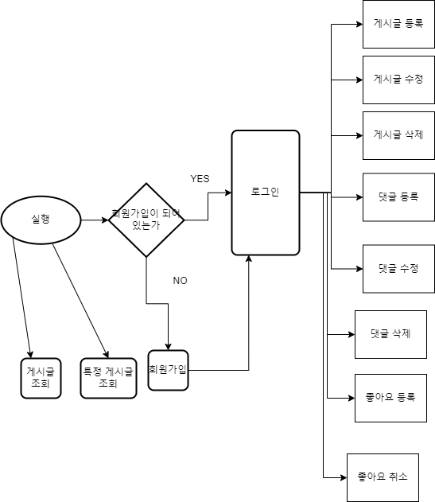
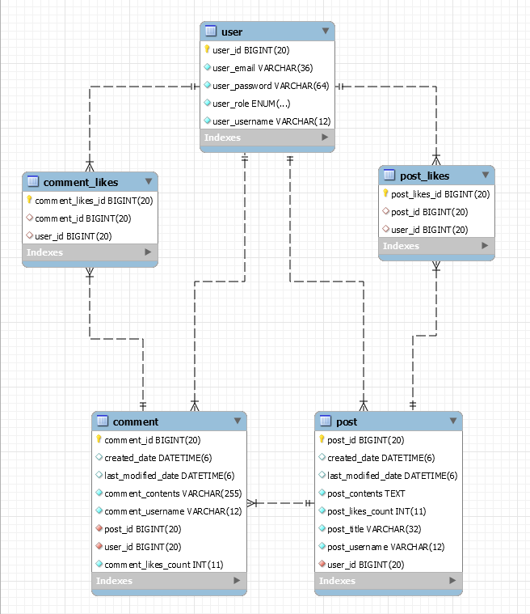

# voyageBlog

spring 개인과제 나만의 블로그 만들기

프로젝트 설명 & API 명세서 & 개발 및 리팩토링 과정 [링크](https://sim34122.oopy.io/189b7be0-21e5-4429-9323-4dcbb0d185e3#189b7be0-21e5-4429-9323-4dcbb0d185e3)
--------------------


----------------------

## 리팩토링

- [x]  dto 필드 validation 설정해주기+예외처리 같이
- [x]  기능별로 커밋 잘 남기기
- [x]  readme 수정
- [x]  aop 적용
- [x]  exceptionfilter 제거
- [x]  lv4 과제 해설 비교
- [x]  post like comment like 합치기

---

- 0803 REFACTORING
    - [x]  postlike 와 commentlike 를 likeservice로 분리
    - [x]  factory를 이용한 생성
    - [x]  동작 테스트
    - [x]  AOP로 api 수행 시간 측정
    - [x]  QueryDSL 적용-
    - [x]  페이징, 정렬 기능을 추가


- 0804 REFACTORING
    - [ ]  Controller 테스트코드 작성
    - [ ]  Service 테스트코드 작성
    - [ ]  Repository 테스트코드 작성
    - [ ]  aws s3 이미지 업로드 구현
    - [ ]  ec2로 .jar 파일 배포

------------------------------

## API 명세서 - swagger 적용 예정

https://documenter.getpostman.com/view/27930567/2s93z86NDq

<details>
<summary>Lv4 UML </summary>
<div markdown="1">
    
    
</div>
</details>
<details>
<summary>Lv4 ERD</summary>
<div markdown="2">



</div>
</details>
<details>
<summary>Lv4 DDL</summary>
<div markdown="2">

```
create table if not exists post.user
(
    user_id       bigint auto_increment
        primary key,
    user_email    varchar(36)            not null,
    user_password varchar(64)            not null,
    user_role     enum ('ADMIN', 'USER') not null,
    user_username varchar(12)            not null,
    constraint UK_jnu1quvkutdk73q9fa4d7abe3
        unique (user_username)
);

create table if not exists post.post
(
    post_id            bigint auto_increment
        primary key,
    created_date       datetime(6)   null,
    last_modified_date datetime(6)   null,
    post_contents      text          not null,
    post_likes_count   int default 0 not null,
    post_title         varchar(32)   not null,
    post_username      varchar(12)   not null,
    user_id            bigint        not null,
    constraint FK72mt33dhhs48hf9gcqrq4fxte
        foreign key (user_id) references post.user (user_id)
);

create table if not exists post.comment
(
    comment_id          bigint auto_increment
        primary key,
    created_date        datetime(6)   null,
    last_modified_date  datetime(6)   null,
    comment_contents    varchar(255)  not null,
    comment_username    varchar(12)   not null,
    post_id             bigint        not null,
    user_id             bigint        not null,
    comment_likes_count int default 0 not null,
    constraint FK8kcum44fvpupyw6f5baccx25c
        foreign key (user_id) references post.user (user_id),
    constraint FKs1slvnkuemjsq2kj4h3vhx7i1
        foreign key (post_id) references post.post (post_id)
);

create table if not exists post.comment_likes
(
    comment_likes_id bigint auto_increment
        primary key,
    comment_id       bigint null,
    user_id          bigint null,
    constraint FKd0epu3dcjc57pwe7lt5jgfqsi
        foreign key (comment_id) references post.comment (comment_id),
    constraint FKgtjsp4k7rsoon6lnxjjx7cnqp
        foreign key (user_id) references post.user (user_id)
);

create table if not exists post.post_likes
(
    post_likes_id bigint auto_increment
        primary key,
    post_id       bigint null,
    user_id       bigint null,
    constraint FKc85he3c94qv5vmyutmf0plp69
        foreign key (user_id) references post.user (user_id),
    constraint FKmxmoc9p5ndijnsqtvsjcuoxm3
        foreign key (post_id) references post.post (post_id)
);
```

</div>
</details>


